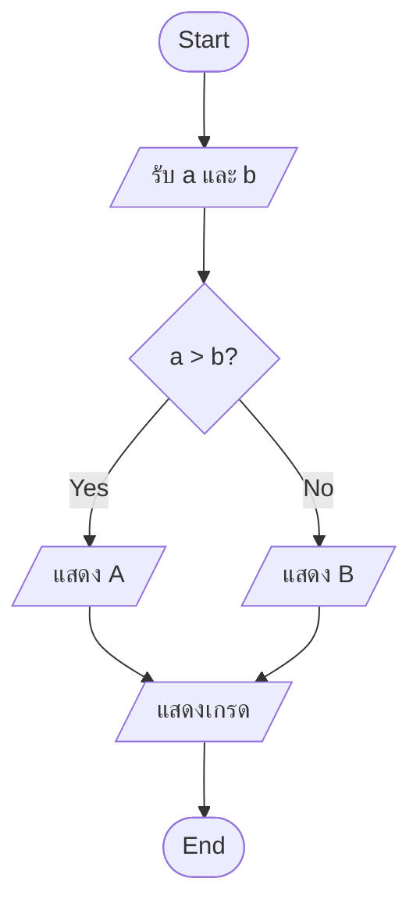
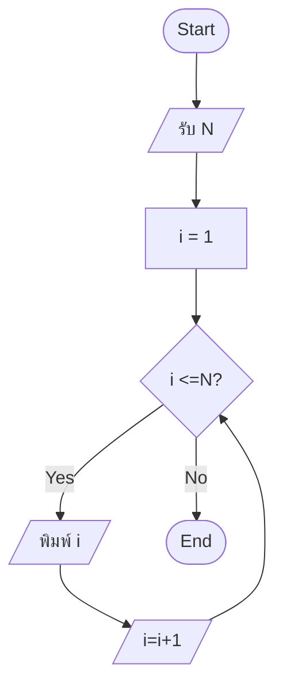
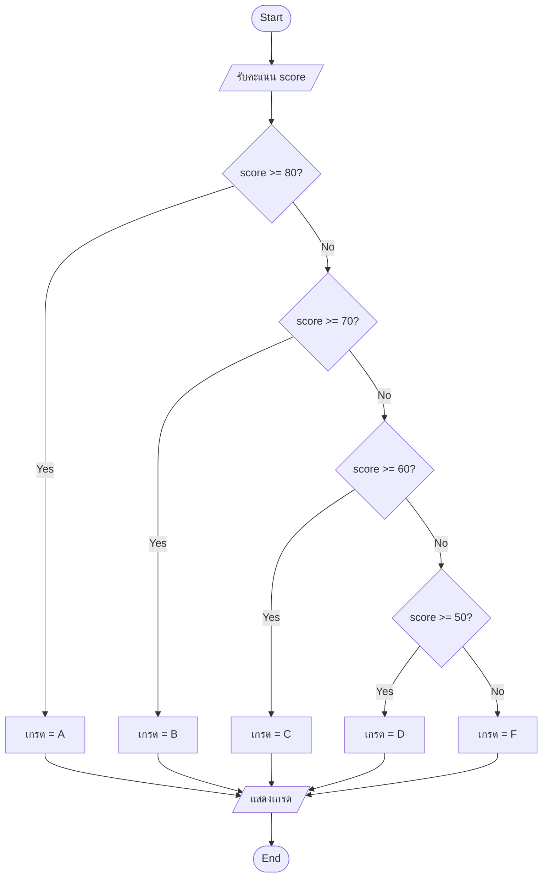

```mermaid
flowchart TD
Start([Start]) --> Input[/รับ a และ b/]
Input --> D1{a > b?}
D1 --> |Yes| A[/แสดง A/]
D1 --> |No| B[/แสดง B/]
A & B --> Output[/แสดงเกรด/]
Output --> End([End])
```

```mermaid
flowchart TD
Start([Start]) --> Input[/รับ N/]
Input --> N[i = 1]
N --> D1{i <=N?}
D1 --> |Yes| A[/พิมพ์ i/]
A --> E[/i=i+1/]
E --> D1
D1 --> |No| B([End])
```

```mermaid
flowchart TD
S([Start]) --> Input[/รับคะแนน score/]
Input --> D1{score >= 80?}
D1 -->|Yes| A[เกรด = A]
D1 -->|No| D2{score >= 70?}
D2 -->|Yes| B[เกรด = B]
D2 -->|No| D3{score >= 60?}
D3 -->|Yes| C[เกรด = C]
D3 -->|No| D4{score >= 50?}
D4 -->|Yes| D[เกรด = D]
D4 -->|No| F[เกรด = F]
A --> Output[/แสดงเกรด/]
B --> Output[/แสดงเกรด/] 
C --> Output[/แสดงเกรด/]
D --> Output[/แสดงเกรด/] 
F --> Output[/แสดงเกรด/]
Output --> End([End])
```
